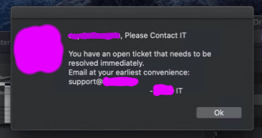

# Filewave Scripts
Scripts to build custom filesets for granular control over remote MacOS and Windows devices.

## MacOS Filewave MDM Fileset Scripts
- [Contact IT Recurring Prompt](mac/contact-it-recurring-prompt) - GUI popups for users who dodge IT
  - 

- [Printer Driver Queues](mac/printer-drivers-queues) - Easy printer queue and driver deployment with pkg and PPD

- [Temporary Admin](mac/temporary-admin) - Grant Mac users on-demand privileges for installing apps remotely, remove association when done to revoke privileges

***

## Windows MDM Fileset Scripts
- [Temporary Admin](windows/temporary-admin) - Grant Windows users on-demand privileges for installing apps remotely, remove association when done to revoke privileges
