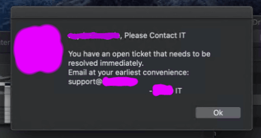
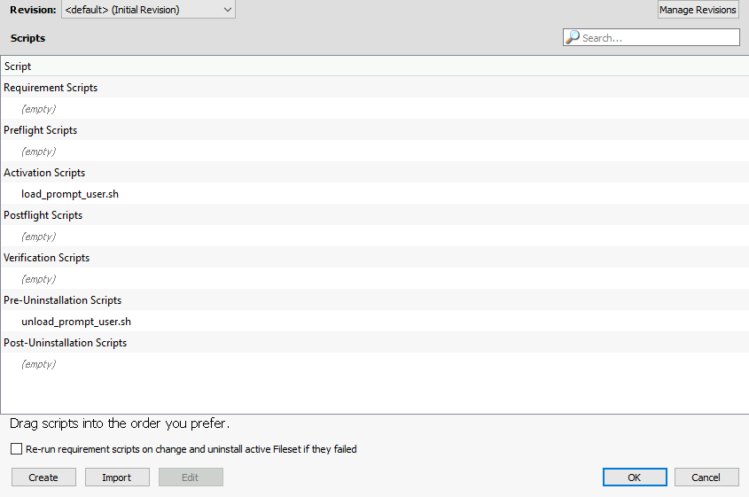

# Contact IT Recurring Prompt for MacOS Using Filewave MDM
Remotely send a prompt (aka "nag screen") reminder to your user's MacOS desktop using a Filewave fileset, complete with a custom app icon for your company or organization.

These scripts (aside from the prompt script itself) were taken from [Filewave's KB](https://kb.filewave.com/display/KB/Notify+Users+-+macOS+and+Windows).

## How it Works
Because Filewave scripts are run as root, doing a simple osascript notification does not work; even if you do their [console as user trick](https://kb.filewave.com/display/KB/Execute+as+Console+User).

However, if you initiate the script as a launch agent, the console as user makes it through to userland.  Use of the launch agent also introduces the ability for scheduling, so it doesn't need to be done within the script.

- Scheduling/frequency is handled by the [plist launcher](Library/LaunchAgents/com.github-angela-d.contactIT.plist)
- The actual notification is generated by a [shell script](contact-it-recurring-prompt.sh)
- Activation script ([runs upon association of the fileset](load_prompt_user.sh)) - activates the launcher to run every `1800` seconds (as set in the launchAgent plist)
- Pre-uninstall  ([runs as the fileset is deleted](unload_prompt_user.sh)) - deactivates the launcher

## Compatible MacOS Versions
- Big Sur 11.4
- Catalina 10.15

## Set Up
> There may be a better way to build a fileset, at the time of writing I am a newb to Filewave but well-versed in programming, so this is my approach.
>
> Feel free to modify these steps if you're a Filewave expert.

- Create an empty **Desktop Fileset**
- Select your newly-created fileset > click on **Scripts** tab inside this fileset and import the scripts as the following (click Import > select file > drag to re-order):
  - 
- Click OK > double-click the fileset to get the scripts tree; un-tick "Hide unused folders" and *make sure* the file structure is that of MacOS:
  - If you're working on this fileset on a Windows machine, it'll import to a Windows folder structure -- you can expand the carats to see the darkened fileset ID (usually a long number string and colored in black whereas others are light grey - drag the black fileset directory to the MacOS path)
- Scripts/files should be in the corresponding directories in Filewave's tree view:
  - `/usr/local/sbin/contact-it-recurring-prompt.sh`
  - `/var/scripts/load_prompt_user.sh`
  - `/Library/LaunchAgents/com.github-angela-d.contactIT.plist`
- Your custom icon in .icns format:
  - `/var/scripts/AppIcon.icns` (drag the icon from your desktop into Filewave's window)

### Customization
:warning: If you replace the icon with an icon that isn't a proper .icns / Apple icon format, it will break the prompt.  Be sure to [convert your custom icon](https://decovar.dev/blog/2018/10/09/macos-convert-png-to-icns/) to Apple's icon format.

Icon sets can also (optionally) be [generated in Xcode](https://www.dev2qa.com/how-to-set-ios-app-icon-in-xcode-project/).

***

**Changing the Prompt Verbiage**

- The message body of the prompt lives in `/usr/local/sbin/contact-it-recurring-prompt.sh` - modify to your heart's content, but be aware of the existing structure.  Using quotes in osascript require some fancy escaping techniques.

**Renaming the Project**

- If you have a need for multiple prompts, you can rename all of the assets included in this repo, just be sure they all reference one another, ie.: change `com.github-angela-d.contactIT` to `com.example.myprompt`

## Usage
- **Send the prompt to a user**
  - Associate the fileset to a client machine; upon activation, it will set up the launcher

- **Remove the prompt for a user**
  - Delete the association for that client machine
