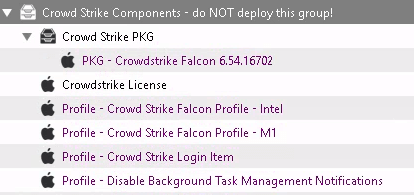
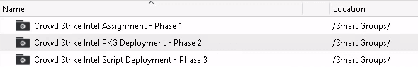

# Crowd Strike Deployment Setup
The profiles must exist *before* the rest of the components are sent, to avoid the user getting any prompts.

**DO NOT DEPLOY ANY FILESET DIRECTLY!**

Crowd Strike deployment is via smart groups only!!

The **fileset** structure is setup, like so:

The **smart group** structure is setup, like so:

### Explanation
---
If pieces of Crowd Strike install before the profile is set, the user gets system extension popups and they must approve them, etc.

By doing the setup in phases, there's a less likelihood of a component getting ahead of it's necessary dependencies.

Caveat is initial deployment is a bit slow, as it requires on the machine checking back in on [Filewave's tickle interval](https://fwkb.atlassian.net/wiki/spaces/KB/pages/4328998).

The smart group does inventory assessments and any machine matching the query setup will get any fileset associated to the given smart group.

***

There are 3 profiles that get sent in **Phase 1**

- Crowd Strike Falcon Profile [hardware type]
    - This whitelists the system extension and numerous other components
- Crowd Strike Login Item Profile
    - Removes the ability for the user to toggle Crowd Strike off under Login Items in system preferences
    - I may need to split this off when I create other login items, so for now, it's a separate profile until I determine whether or not it's necessary to keep separate
- Disable Background Task Management Notifications Profile
    - Same deal as the login items profile + [more info](banner-prompt.md)

**Phase 2** deploys the PKG

- The PKG is the same for each hardware type

**Phase 3** applies our [license CID](https://www.crowdstrike.com/blog/tech-center/install-falcon-sensor/) to the user's install

- If this occurs before the PKG is installed, the Falcon app is in an unusable state

***

**Shared files (Intel + M1)**
- Crowdstrike License
- Crowd Strike Login Item Profile
- Profile - Disable Background Task Management Notifications [[what's this for?]](banner-prompt.md)
- PKG - Crowd Strike Falcon [version]
    - When upgrading the PKG, you only need to do so, once

Unique files for hardware type:
- Profile - Falcon Profile - [hardware]

***

## How-To
Initial Deployment
- [Controlling Deployment by Hardware Type](split-deployment.md)

Routine Maintenance:
- [Upgrading the Falcon PKG](upgrading-falcon.md)

Dashboards:
- [Falcon](https://falcon.us-2.crowdstrike.com/) - Review detections & configure stuff
    - [Users/Roles](https://falcon.us-2.crowdstrike.com/documentation/74/users-and-roles) - Grant others Falcon access
    - [Install Tokens](https://falcon.us-2.crowdstrike.com/hosts/installation-tokens) - Not sure these are useful to us with mass deployment ([more info](https://old.reddit.com/r/crowdstrike/comments/ithoqd/install_tokens/))

- [Support Portal](supportportal.crowdstrike.com) - Contact via chat or ticket; knowledgebase

***

### Other info
- [System Extensions](system-extensions.md)
- [What the Scripts & Profiles Do](script-explanation.md)