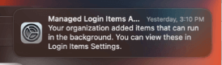

# Profile - Disable Background Task Management Notifications
This is new since Ventura.  Found the plist on the [Jamf Forums](https://community.jamf.com/t5/jamf-pro/quot-login-items-added-quot-in-ventura/m-p/270481) - scottb post.

Without it, users see this upon Crowd Strike license application:
