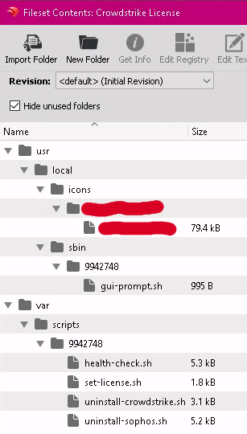
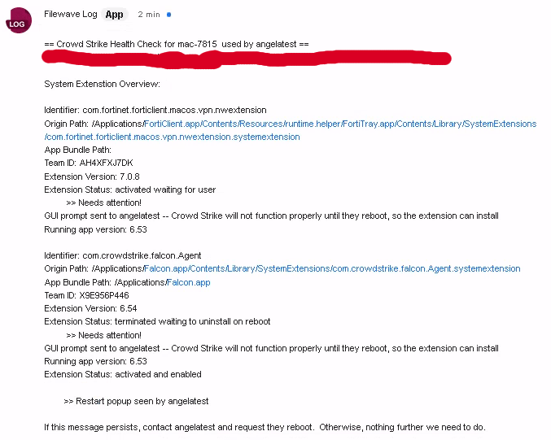
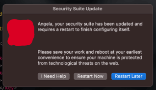
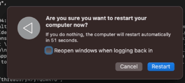

# What the Scripts & Profiles Do
There's a lot of parts to this setup.

**Why there's so many:**

- You have to deploy the profiles before anything.
    - Why not just ship the profiles, first?
        - There is never a time where *all* of the machines are online at the same time.
        - Extra work for new deployments & wipes

## Crowdstrike License (Fileset w/ Scripts)

- [/usr/local/icons/yourcompany/icon.icns](./usr/local/icons/yourcompany/icon.icns)
    - The icon displayed on the popup
- [/usr/local/sbin/9947248/gui-prompt.sh](./usr/local/sbin/9942748/gui-prompt.sh)
    - `9947248` is the fileset ID in Filewave of **Crowdstrike License**
    - `sbin` directory is an unoffocial standard in unix where non-native apps put their executables
        - `gui-prompt.sh` runs in userland (user-mode)
- [/var/scripts/9942748/health-check.sh](health-check.sh)
    - Note the fileset ID after /var/scripts, again
    :warning: Do not **ever** modify this in Filewave's editor, it will break the reboot prompt's special characters: `«event aevtrrst»`
    - `health-check.sh` runs on an endless interval whenever a verification occurs (manual via client view > verify or automatic during the [Filewave tickle interval](https://fwkb.atlassian.net/wiki/spaces/KB/pages/4331361/))
    - Checks to ensure the app version is up to date with the expected version ([assuming the person who uploaded the PKG set it](upgrading-falcon.md))
    - Checks to see if any system extension is partiall installed
        - Sends a prompt to IT in the Filewave chatroom, when an exception is met:

        

        - Sends a prompt to the user, too:

        

        - If the user chooses Restart Now:

            
- [/var/scripts/9942748/set-license.sh](set-license.sh)
    - This applies the CID/license so the agent can activate on users' machines
        - Runs once
- [/var/scripts/9942748/uninstall-crowdstrike.sh](uninstall-crowdstrike.sh)
    - Used during testing and left in as cleanup scripts are good practice.
        - Once Falcon was active, Crowd Strike blocked uninstallation & a regex whitelist was necessary in the Falcon dashboard
        - Subsequent tests it appeared to leave /Applications/Falcon.app behind.  Probably needs more testing, not too worried about it as there's really no scenario, short of leaving Crowd Strike, where this is useful outside of testing.
- [/var/scripts/9942748/sophos-uninstall.sh](sophos-uninstall.sh)
    - Pulls Sophos out of the system and attempts to uninstall the system extensions (so far only get 1/2 without having to do anything manual - Sophos support is unhelpful and tells you to do everything manually, which actually appears to be Apple's fault)
        - Runs once

***

# Profiles

- Crowd Strike Falcon Profile - Intel
- Crowd Strike Falcon Profile - M1
    - These are supplied by Crowd Strike in the Falcon portal

- Crowd Strike Login Item
    - This sets the Crowd Strike app as 'MDM Handled,' so users cannot toggle it off in the Login Items section of System Preferences

- Disable Background Task Management Notifications
    - See this: [banner prompt info](banner-prompt.md)
