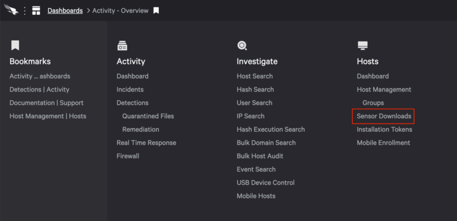

# Upgrading the Falcon PKG
1. Download the sensor installer from Hosts > Sensor Downloads from the Falcon dashboard: 
    

2. It's current naming structure is **PKG - FalconSensorMacOS.MaverickGyr.pkg**

3. Open Filewave Admin
    - Select Filesets from the left menu
    - Locate the **Crowd Strike Components** group
    - Select **Crowd Strike Components** and toward the top bar, click **New Desktop Fileset**
        - Select MSI / PKG

4. Rename `PKG - FalconSensorMacOS.MaverickGyr.pkg` to match the following:
    - `PKG - Crowdstrike Falcon 6.54.16702`
        - Adjust the version string to the current version
        - This makes it easier to see what version is deployed to a machine when viewing the Fileset Status tab in Filewave
5. On a machine that got the update, check and see if the old system extension remains: 
    ```bash
    systemextensionsctl list | grep -i strike
    ```
    There should be 2 extensions and the version should match the new version; so if you are on 6.55.x and you see *three* extension versions and one is for `6.54.16702` - let Angela know.
        - Trace's test machines may already be in this state.  Report back after you test plz

6. Also on a machine that got the update:
    - Right-click on `/Applications/Falcon` > Show Package Contents
    - Navigate to Contents > Info.plist > right-click > view/edit in a code or text editor
    - Look for the key **CFBundleShortVersionString**
    - Add this version to the script `health-check.sh` inside the Filewave script **Crowdstrike License**

    When building this script, the version string *did not* match the version shown when downloading from the Falcon portal, so targeting the portal's version in the script will produce a mass of false-positives.


Once installed, Crowd Strike appears to update itself, so this is probably only necessary intermittently to ensure new deployments don't start off at a too old of version.