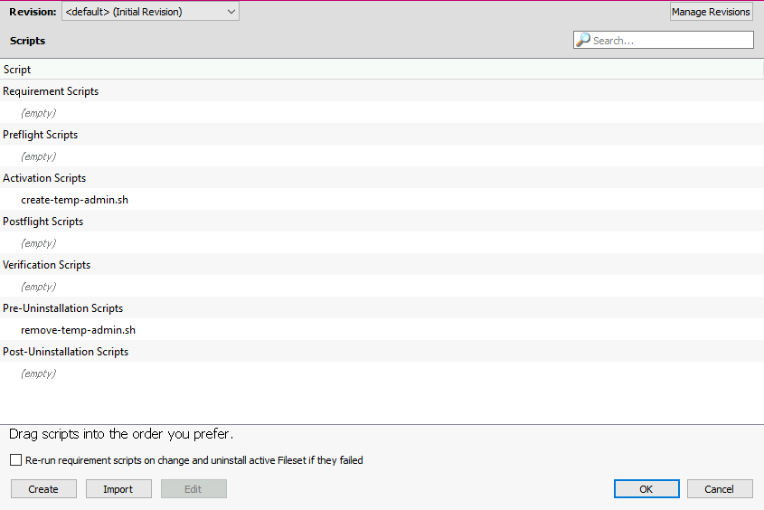

# Temporary Admin for Mac Users Using Filewave MDM for MacOS
Because it's never a good idea for a user to run with admin permissions, there may be situations where a user with standard permissions may require it.

With all of the remote / work from home stuff, this becomes a bit complicated - but with a temporary admin fileset, you can deploy admin permissions on command and revoke when the permissions are no longer needed.

**Caveat**
- Admin permissions are global - at the time of writing this fileset doesn't consider specific use-cases, such as only being able to install applications and do nothing else.  For as long as this fileset is on their machine, they have unfettled admin access at their disposal.

## Usage Scenario
- John is a standard user on his MacOS machine, but needs to install a custom app to get his work done.
  - John is also 4 states over.
- Deploy the temp admin fileset to John's machine; John gets busy installing his new application & lets you know once he's finished.
  - Revoke the fileset; admin permissions are gone, even though John knows the username and password -- the user that has admin powers no longer exists on John's machine.

## Compatible MacOS Version(s)
- Only used on MacOS Big Sur 11.4 (so far)

## Set Up
> There may be a better way to build a fileset, at the time of writing I am a newb to Filewave but well-versed in programming, so this is my approach.
>
> Feel free to modify these steps if you're a Filewave expert.

- Create an empty **Desktop Fileset**
- Select your newly-created fileset > click on **Scripts** tab inside this fileset and import the scripts as the following (click Import > select file > drag to re-order):
  - 
- Click OK > double-click the fileset to get the scripts tree; un-tick "Hide unused folders" and *make sure* the file structure is that of MacOS:
  - If you're working on this fileset on a Windows machine, it'll import to a Windows folder structure -- you can expand the carats to see the darkened fileset ID (usually a long number string and colored in black whereas others are light grey - drag the black fileset directory to the MacOS path)
- Scripts/files should be in the corresponding directories in Filewave's tree view:
  - [/usr/local/etc/scripts/create-temp-admin.sh](create-temp-admin.sh)
  - [/usr/local/etc/scripts/remove-temp-admin.sh](remove-temp-admin.sh)

## After Deploying the Fileset
During an elevation request, the user can utilize the following:
- User: `tempadmin`
- Pass: `tempadmin`

## Revoking the Admin Permissions
- Delete association from the client in Filewave

### Credits
Script originally from [Filewave's KB](https://kb.filewave.com/display/KB/How+to+Create+a+User+Account+on+your+macOS+devices); slightly adjusted for temp admin use-case.
