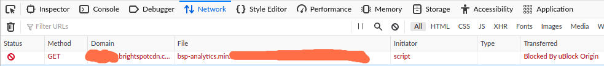

# Override uBlock Origin Filters via Filewave MDM
Assuming uBlock Origin is already [force installed](https://github.com/angela-d/brain-dump/blob/master/sysadmin/windows/active-directory/ublock-origin-custom-deployment.md)

## Scenario 1
User has a *component* on a website that's being blocked and they want to see it.

  - **Confirm uBlock Origin is at Fault**
    - Go to the URL in question (in Firefox), right-click > Inspect (a console will appear) > select the **Network** tab
    - Refresh the page (click the **Reload** button)
      - Sort by the banned/cross-out symbol and you should see in the **Transferred** column, `Blocked by uBlock Origin` (depending on Firefox config, you may see `CSP`); if you do things like [privacy tweaks](https://gist.github.com/0XDE57/fbd302cef7693e62c769), you probably aren't in a similar environment to your end-users, so go to `about:profiles` and create a sandbox profile, for testing and you'll see something like this:

        

  - **Testing**
    - The **Domain** column will tell you what (sub)domain needs to be whitelisted

      - *Whitelisting a subdomain*
        - While testing, I found that in not every scenario, subdomains will work; with embedded content or scripts

        - Open uBlock Origin settings > My Filters, try the following:
        ```bash
        @@||sub.example.com
        ```
        - If the content loads as expected, deploy the following profile to your Mac fleet (or the department that's requesting this override): [Chrome subdomain override for uBlock Origin](subdomain-override.mobileconfig)

## Scenario 2
Marketing department wants to click on tracking links in their email
- **Confirm uBlock Origin is at Fault**
  - Request a forward of the email, providing no PII is contained
  - Once confirmed uBlock Origin is the culprit, deploy the following profile to your Mac fleet (or the department that's requesting this override): [FQDN override for uBlock Origin](fqdnoverride.mobileconfig)


## Post-Testing
Once you're done testing in your sandbox profile, be sure to remove it from `about:profiles`
